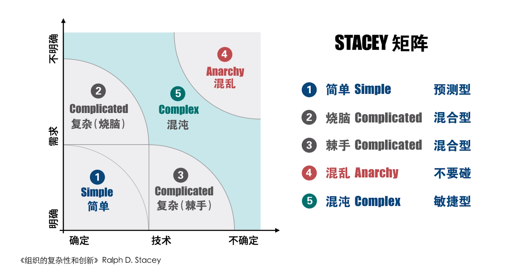
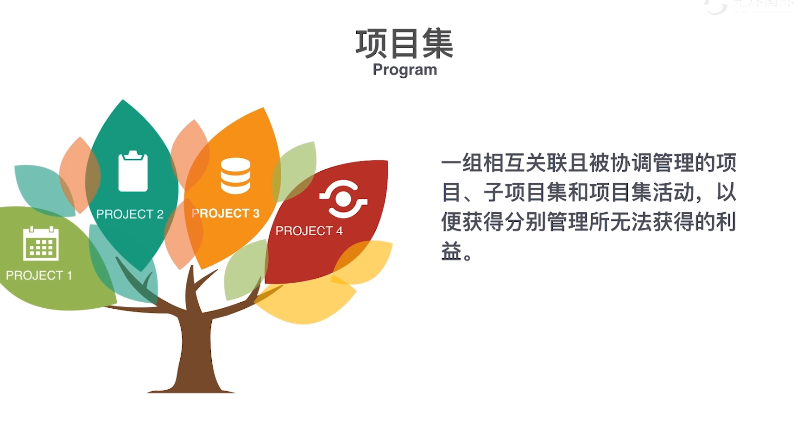
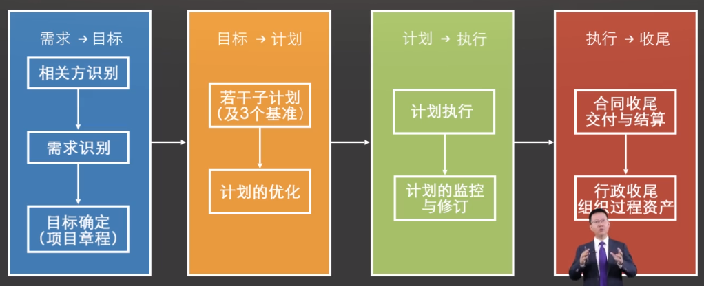

# 第一章：引论

## 初识敏捷

## 项目管理得价值观和方法论

1. **未雨绸缪**（计划、风险）
1. **防微杜渐**（监控、纠正）
1. **资源集成**（整合、采购）
1. **恰到好处**（范围、质量）
1. **循规蹈矩**（过程、制度）
1. **锲而不舍**（目标、变更）
1. **积微成著**（组织过程资产）
1. **公开透明**（沟通、参与）
1. **同舟共济**（共赢、诚信）
1. **各司其职**（授权、平等）

**项目文档的使用手册**

- 变更 - 变更日志
- 需求 - 需求登记册
- 变更后 - 经验教训登记册

## PMP 考试中的角色

| 角色 | 频率 |
| --- | --- |
| 高级管理层 | 4|
| 变更控制委员会 CCB（Change Control Board） | 10 |
| 项目管理办公室 PMO（Project Management Office） | 13 |
| 职能经理（财务、法务、采购、行政、人事） | 18 |
| 发起人（Sponsor） | 42 |
| 项目经理 | 161 |
| 团队 | 291 |
| 项目相关方 | 369 |

**决策变更的角色**：

1. CCB
1. PM

**CCB 和 PM 的区别**：

依据基准（Baseline）区分：

1. 范围基准
1. 进度基准
1. 成本基准

影响基准的变更由 CCB 决定，不影响基准的变更由 PM 决定。

> PMP 考试中，涉及到变更的考题绝大多数由 CCB 决定。

## PMP 考试的“词频”与“图谱”

**题型**

1. 概念：what
1. 场景/情景：how
1. 计算

## 什么是项目

为创造独特的**产品**、**服务**或**成果**而进行的临时性工作。

- **产品**：研发项目
- **服务**：交付项目
- **成果**：变革项目

> 一切皆项目（Everything could be project）

**项目的特征**

- **独特性**（Unique）
- **临时性**（Temporary）：每一个项目都有一个明确的!!开始时间!!和!!结束时间!!，项目是!!一次性的!!。
- **不确定性**（Uncertainty）
  - 应对项目不确定性：渐进明细

## 企业的类型

| 项目甲方 | 项目乙方 |
| --- | --- |
| 业主 | 服务商 |
| 需方 | 供方 |
| 发包方 | 承包方 |
| 买方 | 卖方 |

**企业的经营活动**

项目 -> 运营 -> 项目 -> 运营 -> ...

## 项目与运营

| 项目 | 运营 |
| --- | --- |
| 独一无二 | 重复多次 |
| 时间有限 | 持续不断 |
| 革命性 | 渐进性 |
| 责权不均衡 | 责权均衡 |
| 临时性组织 | 稳定性组织 |
| 效果导向 | 效率导向 |
| 风险（不确定性） | 经验（确定性） |
| 针对性计划 | 标准化规范 |

## 项目经理和职能主管

| 项目经理 | vs. | 职能主管 |
| :---: | :---: | :---: |
| “帅才” | 扮演角色 | “将才” |
| “通才” | 知识结构 | “专才” |
| 目标管理 | 管理方式 | 过程管理 |
| 系统的方法 | 工作方法 | 分析的方法 |
| 责大权小 | 责任权力 | 权责对等 |
| 计划、组织、协调、指导 | 主要任务 | 技术、流程、标准、规范 |

## 项目生命周期

### 一般项目的 4 个阶段

**STAGE1 CONCEPT**
概念阶段

- 需求识别
- 可行性研究
- 商业分析

**STAGE2 DEVELOP**
规划阶段

- 解决方案
- 规划设计
- 预算编制

**STAGE3 EXECUTE**
实施阶段

- 开发/施工
- 需求实现
- 执行与控制

**STAGE4 FINISH**
收尾阶段

- 交付验收
- 合同支付
- 总结经验

### 生命周期分类

- 预测型
- 迭代型
- 增量型
- 适应型

项目不同阶段资源投入

项目生命周期与资源投入

#### 预测型

#### 迭代型

#### 增量型

#### 适应型（敏捷型）

#### 产品研发的混合型生命周期

## STACEY 矩阵

敏捷适用性评估

## 产品生命周期与项目生命周期

## 战略管理与项目管理

战略管理

项目管理

企业管理金字塔

## 项目管理的目标

### 基本目标

- 进度
- 质量
- 成本

### 高层次目标

- 实现组织（企业）的战略目标
- 项目相关方满意
- 项目团队成员满意
- HSE（Health、Safety、Environment）

## 项目管理：企业管理模式转变

### 科层式组织

企业内部隔阂

### 扁平化组织

打工人 -> 合伙人

**项目为单元的精细管理模式**

资源以项目为中心，面向项目的配置

## 推动项目管理普及的力量

## 什么是项目集管理

项目，项目集和项目组合（Project，Program & Portfolio）

### 项目集

> 把互相之间有着联系，有着逻辑关系的项目去优化统筹实现 1 + 1 > 2 的效果
> 互相配合，1 + 1 > 2

项目集管理示意图

### 项目组合

> 战略目标一致，战略优先级一样

### 项目集 vs 项目组合

项目、项目集、项目组合时间的关系

项目集和项目组合案例

## 项目管理五大过程组与十大知识领域

项目管理五大过程组

项目管理49个过程

实施整体变更控制

实施整体变更控制数据流向图

五大过程组之间的相互作用

### 项目管理知识体系的三个维度

- Time：4 阶段
- Management：5 过程
- Knowledge：10 知识领域

### 项目阶段与过程组的关系

### 十大知识领域之间的逻辑

### 项目的子计划

项目子计划之间的逻辑

### 传统项目管理和敏捷方法的区别

传统项目管理滚动式计划

### 什么是“裁剪”？

项目裁剪

