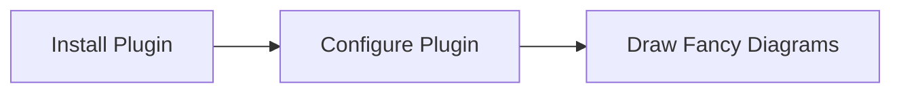

# 一级标题

这是一些内容，这是一些内容，这是一些内容，这是一些内容。
这是一些保留换行的内容，这是一些保留换行的内容，这是一些保留换行的内容。

这是第二段的内容，这是第二段的内容，这是第二段的内容。
这是第二段的内容，这是第二段的内容，这是第二段的内容。这是第二段的内容。

## 二级标题

这是一些内容，这是一些内容，这是一些内容，这是一些内容。

### 三级标题

这是一些内容，这是一些内容，这是一些内容，这是一些内容。

#### 四级标题

这是一些内容，这是一些内容，这是一些内容，这是一些内容。

##### 五级标题

这是一些内容，这是一些内容，这是一些内容，这是一些内容。

###### 六级标题

这是一些内容，这是一些内容，这是一些内容，这是一些内容。


## 删除

~~delete~~

## 行内代码

`code`

## 列表

### 无序列表

- abc
- def
- hij
- kli

### 有序列表

1. asb
1. asb
1. asb
1. asb
1. asb


## 引用

> 引用应用引用应用引用应用引用应用引用应用
> 引用应用引用应用引用应用引用应用引用应用
> 引用应用引用应用引用应用引用应用引用应用


## 表格

| abc | abc | abc |
| --- | --- | --- |
| abc | abc | abcabcabcab |
| abc | abc | abc |
| abc | abc | abc |


## [代码块](https://www.gatsbyjs.com/plugins/gatsby-remark-prismjs/)

### 带有语言标签及行数高亮

````markdown
```javascript
// In your gatsby-config.js
plugins: [
  {
    resolve: `gatsby-transformer-remark`,
    // highlight-start
    options: {
      plugins: [
        `gatsby-remark-prismjs`,
      ]
    }
    // highlight-end
  }
]
```
````

==>

```javascript
// In your gatsby-config.js
plugins: [
  {
    resolve: `gatsby-transformer-remark`,
    //highlight-start
    options: {
      plugins: [
        `gatsby-remark-prismjs`,
      ]
    }
    //highlight-end
  }
]
```

or

````markdown
```javascript{2,6,11}
// In your gatsby-config.js
plugins: [
  {
    resolve: `gatsby-transformer-remark`,
    options: {
      plugins: [
        `gatsby-remark-prismjs`,
      ]
    }
  }
]
```
````

==>

```javascript{2,6,11}
// In your gatsby-config.js
plugins: [
  {
    resolve: `gatsby-transformer-remark`,
    options: {
      plugins: [
        `gatsby-remark-prismjs`,
      ]
    }
  }
]
```

### 带有标题

markdown

````markdown
```jsx:title=title
class ComponentComponentComponentComponent extends React.Component {
    return (
        <div>text</div>
    )
}
```
````

==>

```jsx:title=title
class ComponentComponentComponentComponent extends React.Component {
    return (
        <div>text</div>
    )
}
```


## plugins

### remark-container

:::info
info
:::

:::important
important
:::

:::tip
tip
:::

:::success
success
:::

:::note
note
:::

:::warning
warning
:::

:::danger
danger
:::

:::other
other type text
:::

:::other custom title
custom title
:::

:::plain
text text text
text text text

another paragraph text
:::

:::
no type
no type
:::

### gatsby-remark-mermaid

流程图

[更多语法](https://mermaid-js.github.io/mermaid/#/)

[live editor](https://mermaid-js.github.io/mermaid-live-editor/)




### remark-breaks

文字换行

文字文字文字文字
文字文字文字文字


### gatsby-remark-import-code

类似于： _https://www.gatsbyjs.org/packages/gatsby-remark-embed-snippet/_

项目中使用 gatsby-remark-import-code

below code from external file

```js file=./external.js
```


### remark-underline

```markdown
__underline text__
```

==>

__underline text__


### remark-inline-highlight

```markdown
!!abcc!!
```

==>

!!abcc!!
