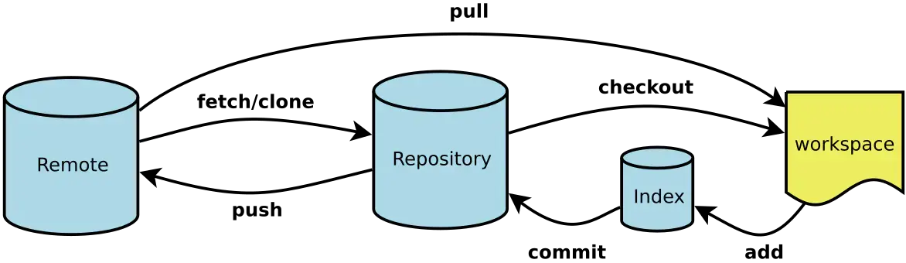

# 学习资源

- [Git Pro](https://git-scm.com/book/zh/v2)
- [猴子都能懂的 GIT 入门](https://backlog.com/git-tutorial/cn/)
- [廖雪峰 Git 教程](https://www.liaoxuefeng.com/wiki/896043488029600)
- [一张脑图带你掌握Git命令](https://juejin.im/post/6869519303864123399)
- [使用git rebase合并多次commit](https://juejin.im/entry/6844903600976576519)
- [git reset 和 git revert](https://juejin.im/post/6844903614767448072)

## 基本概念

Git 操作流程

