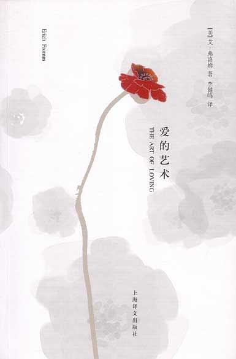

# 爱的艺术

*[在线阅读](https://m.99csw.com/book/1145/index.html)*

## 摘录

### 第一章：爱是一门艺术吗？

:::
爱情不是一种与人的成熟程度无关，只需要投入身心的感情。如果不努力发展自己的全部人格并以此达到一种创造倾向性，那么每种爱的试图都会失败；如果没有爱他人的能力，如果不能真正谦恭地、勇敢地、真诚地和有纪律地爱他人，那么人们在自己的爱情生活中也永远得不到满足。
:::

:::
可以简单地把学会一门艺术分成两个部分，一是掌握理论，二是掌握实践。学医的人首先要认识人体的结构和各种疾病的症兆。但光有理论还无法行医。只有通过长期的实践活动，一直到理论知识和实践经验融会贯通起来变成灵感—也就是掌握了艺术的灵魂，才能成为一名大师。要成为大师，除了学习理论和实践外还有第三个必不可少的因素，即要把成为大师看得高于一切，这一目标必须占据他整个身心。这一点既适用于音乐、医学、雕塑—也适用于爱情。
:::

### 第二章：爱情的理论

#### （一）爱情是对人类生存问题的回答

:::
人拥有理智；人是生命，一种意识到自我存在的生命。人意识到自己，他人，人的过去和发展前途的可能性。人对他的单一存在的觉悟，对他短暂生命的觉悟，人意识到生不由己，死的必然，人知道自己的孤独和与世隔绝，意识到面对社会和自然的威力自己的无能为力—所有这一切都使他的特殊和孤寂的存在成为无法忍受的监禁。如果人不能从他的监狱中解放出来和打碎这一监狱，如果他不能以这种或那种方式，同他人或周围世界结合在一起，他就会疯狂。
:::

:::
经历过孤寂的人必然会有恐惧感。实际上孤寂感是每种恐惧的根源。孤寂意味着与外界没有联系，不能发挥人的力量，意味着一筹莫展，不能把握世界，事物和人；意味着世界把我淹没，而我只能听之任之。所以孤寂是引起强烈恐惧感的根源，同时孤寂还会引起羞愧和负罪的感觉。
:::

:::
因此对人来说最大的需要就是克服他的孤独感和摆脱孤独的监禁。人在达到这一目的过程中的完全失败就会导致人的疯狂，因为人只有通过完全彻底地脱离周围世界，以至于不再感到与世隔绝，他对彻底孤独的恐惧感才会得到克服—因为他与之隔绝的世界从他的生活中消失了。
:::

:::
通过纵欲达到人与人之间的结合的所有方式都有三个特征：首先这些方式都是强烈的，甚至会很激烈；其次它们需要整个人—包括身心都投入进去，第三就是需要不断重复—因为纵欲的效果只能持续很短的时间。但是，无论是过去的人，还是现代人，克服孤独感最常用的方法却与此截然相反。这一方法就是通过同一组人保持一致，通过同一组人的习惯、风格和看法保持一致来达到同其他人的结合。这一方法的发展也有一个历史过程。
:::

:::
在一个低级社会中一组人为数甚少，往往是由血缘关系相近或者生活在一起的人组成。随着文化的发展，一组人的人数也随之增长，它变成了一个政治体、国家或一个教派。就是最穷的罗马人也能自豪地说“我是罗马的公民！”罗马和罗马帝国就是他的家，他的祖国和世界。在今日的西方社会，同一组人结合仍然是克服孤独感最常用的方法。在这种结合中，参加者为了使自己属于这一组人而失去了大部分个性。如果我与他人完全一样，我的感情、思想与他人一致，我的衣着、习惯和看法都与这一组人的楷模看齐，我就可得救，就不会再经历可怕的孤独。专政的国家形式需要用威胁和恐怖手段去制造同一状态，而民主政权里还存在抵制这种同一性的可能性，在这样的社会里也确实能看到这种例子。但在专制制度里只有少数非凡勇敢的英雄和殉道者才会抵制顺从。虽然民主制度和专制的国家形式有区别，然而民主制度把人变成一个模式的程度也委实使人担心，造成这种现象的原因是人们总想通过某种方式实现同他人结合，如果没有别的更好的方式，那就只能采取同一群人同一的方式。我们只有理解了人是多么害怕与别人隔绝，才能懂得担心与众不同和同一群人疏远会产生何等的威力。有时这种担心是可以原谅的，因为人们考虑到与众不同会带来实际危险。但事实上人们多半是自发地、而不是被迫地这样做—至少在西方民主国家中是如此。
:::

:::
大多数人并不意识到自己身上有这种要求。他们生活在一种幻觉中，以为自己是按照个人的意愿行事，是具有个性的人，是经过大脑的思考形成自己的看法—他们认为他们的观点之所以和大多数人吻合纯粹是巧合罢了。他们甚至认为这正好证明了“他们”的观点是正确的。至于他们尚存的、希望自己有个性的要求则通过微不足道的东西得到满足：如在手提箱和毛衣上绣上自己的名字的缩写字母，在玻璃窗口上挂上自己的名牌，参加一个政党或者一个学生联合会。《来点儿别的》这一广告口号证明了在一个几乎不存在个性的社会现实中，人们是何等地需要个性！
:::

:::
在谈及这一方法时，还必须考虑到我们现代社会生活的另一个因素：那就是工作和恢复疲劳的循环作用。人作为劳动大军和管理阶层的一员仅仅是一个号码而已。他几乎不需要有任何主观能动性，他的任务由劳动的组织派定。领导和被领导之间也几乎没有区别，因为他们都在行使由整个组织结构规定的任务，不仅要按规定的速度，也要按规定的方式完成。甚至他们的各种感情，如高兴、宽容、信任、雄心以及同每个人顺利合作的能力都是预先规定的。他们的娱乐方式即使不那么强求一律，也都是大同小异。阅读的书是读书俱乐部选定的；看的电影是电影院老板和他们出钱登印的广告选定的；其他的娱乐方式也都雷同：星期日驾车远足、看电视、打牌和社交活动。从生到死，从星期一到星期日，从早到晚—所有的行动都是千篇一律和按照预定的方式进行。请问：一个被围困在这么一个罗网之中的人如何才能不忘记他是一个人，只存在一次的人，只有一次生存的机会，能经历希望、失望、担心和恐惧的人，渴望爱情和受到虚无和孤独威胁的人呢？
:::

:::
通过创造性的劳动达到的统一不是人与人之间的统一。通过纵欲达到的统一是暂时的。通过同一组人同一和适应这一组人达到的统一仅仅是一种假统一。对人类存在问题的真正的和全面的回答是要在爱中实现人与人之间的统一。
:::

:::
同共生有机体结合相对立的是成熟的爱情，那就是在保留自己完整性和独立性的条件下，也就是保持自己个性的条件下与他人合二为一。人的爱情是一种积极的力量，这种力量可以冲破人与人之间的高墙并使人与人结合。爱情可以使人克服孤寂和与世隔绝感，但同时又使人保持对自己的忠诚，保持自己的完整性和本来的面貌。**在爱情中出现了两个生命合为一体，却依然保持两体的怪现象。**
:::

:::
如果我们说，爱情是一项“积极的活动”，我们就会遇到“积极的活动”这个词有双重意义的问题。这个词的现代用法一般就是指人们通过付出劳动改变现存状态的行为。所以经商的人，学医的人，流水作业线上的工人，做椅子的木匠或者运动员都是积极活动的人。他们活动的共同点都是为了达到一个外部的目的。但这里我们都没有考虑产生积极性的根源。我们可以举一个例子加以说明。有的人由于内心极度的不安或者孤独而狂热地工作，有的人则是为了升官发财。在这种情况下这个人就是一种狂热、一种热情的奴隶，而他的“积极性”实际上是一种“消极性”，因为他是受外力的驱使。他是一个受苦的人，而不是一个“行动”的人。另一方面人们往往把一个坐在椅子上沉思默想、观察和体验自己以及自己同世界关
:::

:::
爱情是一种积极的，而不是消极的情绪。一般来说可以用另一个说法来表达，即**爱情首先是给而不是得**。
:::

:::
什么是“给”？这个问题看起来似乎很容易回答，实际上却很复杂并有双层意义。十分流行的误解是把“给”解释为放弃，被别人夺走东西或作出牺牲。一个性格还没有超越接受、利用或者贪婪阶段的人对给的理解就是这样。一个“重商主义”的人也准备给，但一定要通过交换。只“给”而没有“得”对他来说就是欺骗。③那些基本上是非生产性性格结构的人则会有一种被别人拿走东西的感觉。因此这种类型的大多数人拒绝给予别人东西。而有些人却又把“给”变成一种自我牺牲的美德。他们认为，正因为“给”是痛苦的，所以应该这么做。给的美德就是准备牺牲，对他们来说，“给”比“得”好这一准则就是意味着宁可忍受损失也不要体验快乐。
:::

:::
在物质世界范畴内给是财富。不是拥有财物的人是富裕的，而是给予他人东西的人才是富裕者。害怕受到损失的吝啬鬼，不管他拥有多少财产，从心理学角度来看，他是一个贫穷和可怜的人。愿意把自己的东西给予他人的人却是富有的，他感觉到自己是一个有能力帮助别人的人。只有那些连生活必需品都没有的人才不能体验帮助别人的乐趣。但是日常生活经验告诉我们，衡量有没有足够生活必需品的标准既取决于人的实际财产，也取决于人的性格本质。众所周知穷人往往比富人更愿意给。尽管如此，超过一定限度的贫困往往使许多人无法给，恰恰这一点是十分令人懊丧的—这不仅仅是因为从中可以看到穷人的贫困，同时也是因为穷人被剥夺了给所带来的欢乐。
:::

:::
但给的最重要范畴还不是物质范畴，而是人所具有的特殊范畴。一个人究竟能给予别人什么呢？他可以把他拥有的最宝贵的东西，他的生命给予别人。但这并不一定意味着他一定要为别人献出自己的生命，而是他应该把他内心有生命力的东西给予别人。他应该同别人分享他的欢乐、兴趣、理解力、知识、幽默和悲伤—简而言之一切在他身上有生命力的东西。通过他的给，他丰富了他人，同时在他提高自己生命感的同时，他也提高了对方的生命感。他给并不是为了得，但是通过他的给，不可避免地会在对方身上唤起某种有生命力的东西。因此他的给同时也包括了使接受者也成为一个给的人，而双方都会因为唤醒了内心的某种生命力而充满快乐。在给的行为中诞生了新的东西，给和得的人都会感谢这新的力量。这一点表现在爱情上就是：没有生命力就是没有创造爱情的能力。马克思极其优美地表达了上述思想。他说：“如果你以人就是人以及人同世界的关系是一种充满人性的关系为先决条件，那么你只能用爱去换爱，用信任换取信任。如果你想欣赏艺术，你必须是一个有艺术修养的人；如果你想对他人施加影响，你必须是一个能促进和鼓舞他人的人。你同人及自然的每一种关系必须是你真正个人生活的一种特定的、符合你的意志对象的表现。如果你在爱别人，但却没有唤起他人的爱，也就是你的爱作为一种爱情不能使对方产生爱情，如果作为一个正在爱的人你不能把自己变成一个被人爱的人，那么你的爱情是软弱无力的，是一种不幸。”⑤不仅在爱情上“给”意味着“得”。教师向他的学生学习，演员受到观众的鼓舞，精神分析学家通过治愈他人的病而治愈自己的病也都如此，先决条件是给的人不应该把对方看作是他帮助的对象，而应该同对方建立一种真正的、创造性的紧密关系。
:::

:::
如果爱情没有第三个要素：尊重，那责任心就很容易变成控制别人和奴役别人。尊重别人不是惧怕对方。尊重这个词的出处就是有能力实事求是地正视对方和认识他独有的个性。尊重就是要努力地使对方能成长和发展自己，因此尊重决无剥削之意。我希望一个被我爱的人应该以他自己的方式和为了自己去成长、发展，而不是服务于我。如果我爱他人，我应该感到和他一致，而且接受他本来的面目，而不是要求他成为我希望的样子，以便使我能把他当作使用的对象。只有当我自己达到独立，在没有外援的情况下独立地走自己的路，即不想去控制和利用别人，只有在这种情况下，尊重对方才成为可能。只有在自由的基础上才会有爱情，正像在一首古老的法国歌曲中唱的那样“爱情是自由之子，永远不会是控制的产物”。
:::

:::
人们只有认识对方，了解对方才能尊重对方。如果不以了解为基础，关心和责任心都会是盲目的，而如果不是从关怀的角度出发去了解对方，这种了解也是无益的。了解的方式多种多样。成为爱情一要素的了解是要深入事物的内部，而不是满足于一知半解。我只有用他人的眼光看待他人，而把对自己的兴趣退居二位。我才能了解对方。譬如：我可以知道这个人在生气，即使他自己不表露出来。但我还可以更进一步地去了解他，然后就知道，他很害怕和不安，他感到孤独和受到良心的谴责。这样我就明白他的生气只是他内部更深的东西的反映，这时我眼中的他不再是一个发怒的人，而是一个处在恐惧和惶恐不安之中的受苦的人。
:::

#### （二）父母和孩子之间的爱

:::
天真的、孩童式的爱情遵循下列原则：“我爱，因为我被人爱。”成熟的爱的原则是：“我被人爱，因为我爱人。”不成熟的、幼稚的爱是：“我爱你，因为我需要你”，而成熟的爱是：“我需要你，因为我爱你。”
:::

#### （三）爱的对象

:::
爱首先不是同一个特殊的人的关系，而更多的是一种态度，性格上的一种倾向。这种态度决定一个人同整个世界，而不是同爱的唯一“对象”的关系。如果一个人只爱他的对象，而对其他的人无动于衷，他的爱就不是爱，而是一种共生有机体的联系或者是一种更高级意义上的自私。尽管如此大多数人都认为爱情取决于对象，而不是能力。他们甚至认为专爱一个人就是强烈爱情的证明。我们在上面已经提到过这一错误的结论。正因为人们不是把爱情看作是一种积极的行动，灵魂的一股力量，所以他们认为只要找到爱的对象就行，别的东西自然而然就会产生。可以把这一态度同想画一张画的人作一比较：这个人虽然想画画，但他不是去学绘画这门艺术，而是强调他首先要找到他愿意画的合适的对象。如果他找到了这么一样东西，他也就能画了。如果我确实爱一个人，那么我也爱其他的人，我就会爱世界，爱生活。如果我能对一个人说：“我爱你”，我也应该可以说：“我在你身上爱所有的人，爱世界，也爱我自己。”
:::

##### （1）博爱

:::
一切爱的形式都以博爱为基础。我指的博爱就是对所有的人都有一种责任感，关心、尊重和了解他人，也就是愿意提高其他人的生活情趣。这也是圣经里提到的一种爱的方式：爱他人应如爱己。博爱是对所有人的爱，其特点是这种爱没有独占性。如果我具有爱的能力，我就会去爱我周围的人。在博爱中凝聚着同所有人的结合，人的团结和统一。博爱的基础是认识到我们所有的人都是平等的。同人共有的核心相比，人与人之间在才能、智力和知识上的差别微不足道。要了解这种人共有的核心，必须要深入了解人，而不是停留在表面。如果我只看到一个人的表面，那我看到的主要是使我和他分开的差别。如果我了解到他的本质，我就会看到我们的共性，我们是兄弟这一事实。这样的一种核心对核心的关系—用来取代表面对表面的关系—是一种“中心关系”。西莫尔?魏尔曾经很优美地表达过这种关系：“同样的话(即丈夫对他妻子说“我爱你”)可以是很一般的，也可以非同一般，这要按说这些话的方式而定。说话的方式则取决于这些话发自内心的深度，而不取决于个人意志。在双方息息相通的情况下，这些话会触动对方相等的内心深度。所以一个有能力区别的人就会听得出来这些话的份量究竟有多大！”
:::

- 原则上爱自己和爱别人是不可分的。真正的爱是内在创造力的表现，包括关怀、尊重、责任心和了解诸因素。爱不是一种消极的冲动情绪，而是积极追求被爱人的发展和幸福，这种追求的基础是人的爱的能力。
- 对许多人来说还有一系列克服人与人隔离的方法。讲述自己的生活，叙述自己的希望和恐惧，谈出自己幼稚的或者不成熟的梦想，以及找到面对世界的共同利益—所有这一切都是克服人与人之间隔离的途径。甚至表露自己的愤怒和仇恨，毫无顾忌地交心也都被看出是亲密的表现。
- 天真的、孩童式的爱情遵循下列原则：“我爱，因为我被人爱。”成熟的爱的原则是：“我被人爱，因为我爱人。”不成熟的、幼稚的爱是：“我爱你，因为我需要你”，而成熟的爱是：“我需要你，因为我爱你。”
- 阳性的特点是渗透、指导、积极、守纪律和善于冒险，而阴性则具有接受、保护、求实、忍耐和母性的特点。
- 关心、责任心、尊重和了解是相互依赖的。在成熟的人身上可以看到这些态度的集中表现。成熟的人就是指能够创造性地发挥自己力量的人。成熟的人只想拥有他自己的劳动果实，放弃了获取全力和全知的自恋幻想，并有一种谦恭的态度。这一态度的基础是他内心的力量，单单这股力量就能使他进行真正的、创造性的劳动。
- 先决条件是给的人不应该把对方看作是他帮助的对象，而应该同对方建立一种真正的、创造性的紧密关系。
- 马克思极其优美地表达了上述思想。他说：“如果你以人就是人以及人同世界的关系是一种充满人性的关系为先决条件，那么你只能用爱去换爱，用信任换取信任。如果你想欣赏艺术，你必须是一个有艺术修养的人；如果你想对他人施加影响，你必须是一个有艺术修养的人；如果你想对他人施加影响，你必须是一个能促进和鼓舞他人的人。你同人及自然的每一种关系必须是你真正个人生活的一种特定的、符合你的意志对象的表现。如果你在爱别人，但却没有唤起他人的爱，也就是你的爱作为一种爱情不能使对方产生爱情，如果作为一个正在爱的人你不能把自己变成一个被人爱的人，那么你的爱情是软弱无力的，是一种不幸。”
- 一个人究竟能给予别人什么呢？他可以把他拥有的最宝贵的东西，他的生命给予别人。但这并不一定意味着他一定要为别人献出自己的生命，而是他应该把他内心有生命力的东西给予别人。他应该同别人分享他的欢乐、兴趣、理解力、知识、幽默和悲伤—简而言之一切在他身上有生命力的东西。通过他的给，他丰富了他人，同时在他提高自己生命感的同时，他也提高了对方的生命感。他给并不是为了得，但是通过他的给，不可避免地会在对方身上唤起某种有生命力的东西。因此他的给同时也包括了使接受者也成为一个给的人，而双方都会因为唤醒了内心的某种生命力而充满快乐。在给的行为中诞生了新的东西，给和得的人都会感谢这新的力量。这一点表现在爱情上就是：没有生命力就是没有创造爱情的能力。

## 简介

### 内容简介

《爱的艺术》是德裔美籍心理学家和哲学家、法兰克福学派重要成员艾里希-弗洛姆最著名的作品，自1956年出版至今已被翻译成32种文字，在全世界畅销不衰，被誉为当代爱的艺术理论专著最著名的作品。

在这本书中，弗洛姆认为，爱情不是一种与人的成熟程度无关，只需要投入身心的感情。如果不努力发展自己的全部人格并以此达到一种创造倾向性，那么每种爱的试图都会失败，如果没有爱他人的能力，如果不能真正谦恭地、勇敢地、真诚地和有纪律地爱他人，那么人们在自己的爱情生活中也永远得不到满足。

弗洛姆进而提出，爱是一门艺术，要求想要掌握这门艺术的人有这方面的知识并付出努力。在这里，爱不仅仅是狭隘的男女爱情，也并非通过磨练增进技巧即可获得。爱是人格整体的展现，要发展爱的能力，就需要努力发展自己的人格，并朝着有益的目标迈进。

此版特别收录弗洛姆学术助手纪念文章《弗洛姆生命中的爱》。

### 作者简介

艾里希·弗洛姆，著名德裔美籍心理学家、精神分析学家、哲学家。1900年生于德国法兰克福犹太人家庭，1922年获德国海德堡大学哲学博士学位，是二十年代“法兰克福学派”重要成员。纳粹上台后，他于1934年赴美，在从事心理咨询工作的同时，在哥伦比亚大学等学术机构讲学，并先后执教于墨西哥国立大学、密歇根州立大学等高校。1980年弗洛姆病逝于瑞士洛伽诺。

弗洛姆的研究植根于弗洛伊德的精神分析学说和马克思主义哲学理论。他认为人是各自所在的产物，在现代工业化社会，人变得越来越自我疏离，这种孤立感导致人们潜意识下渴望与他人结合、联系。

弗洛姆以深入浅出、平易近人的文笔，创造了大量学术著作和普及性作品，其中影响最大的有《爱的艺术》、《逃避自由》、《健全的社会》、《精神分析的危机》等。
