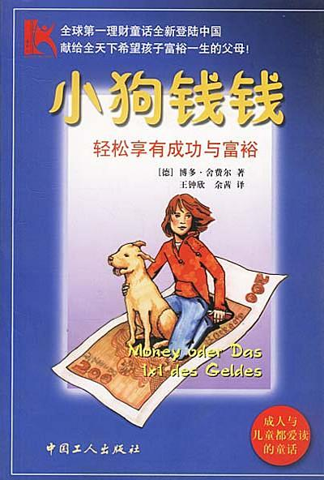

# 小狗钱钱

## 摘录

:::
好奇是好的，但是绝不能让好奇阻碍你做事。太多的人做事犹豫不决，就是因为他们觉得没有完全弄懂这件事。**真正付诸实践要比纯粹的思考有用多了。**
:::

:::
不是试试看，而是去切实行动！如果你只是抱着试试看的心态，那么你只会以失败告终，你会一事无成。‘尝试’纯粹是一种借口，你还没有做，就已经给自己想好了退路。**不能试验，你只有两个选择——做或者不做。**
:::

:::
成功的人之所以成功，就是因为他们一直梦想着自己成功的那一天，不停地想象着自己实现了理想时的情形。
:::

:::
学习就是认识新观念和新想法的过程。假如人们始终以同一种思维方式来考虑问题的话，那么始终只会得到同样的结果。因为我对你讲述的许多内容是你以前从未接触过的，所以我建议你，在你还没有做之前，不要轻易下结论。没有想象力的人是很难成就大事的。我们对一件事投入的精力越多，成功的可能性也越大。可是大多数人把精力放在自己并不喜欢的事情上，而不去想象自己希望得到的东西。
:::

:::
在你展翅飞翔之前，你就必须相信自己能到达目的地。
:::

:::
机会到处都是，但是只有在你寻找它的时候，你才能看见它。只有当你心中有了强烈的渴望，你才会去寻觅机会。而当你想象的时候，强烈的渴望就产生了。
:::

:::
**也许确实是这么一回事，但是我还是要说，你太容易放弃了，连试一下都不愿意。在做什么事之前，你总是首先想‘这事是做不成的’，这样肯定不会成功。**
:::

:::
你的自信程度决定了你是否相信自己的能力，是否相信你自己。假如你根本不相信你能做到的话，那么你就根本不会动手去做，而假如你不开始去做，那么你就什么也得不到。
:::

:::
第一，为别人解决一个难题，那么你就能赚到许多钱；第二，把精力集中在你知道的、能做的和拥有的东西上。
:::

:::
成人经常把一生的时间都用来考虑他们不知道、不能做或没有的东西上。
:::

:::
三点重要的事情：

**第一**

首先，在遇到困难的时候，仍然要坚持自己的想法。一切正常的时候，每个人都能做到这一点。只有当真正的困难出现时才能见分晓。只有少数人能坚定不移地贯彻自己的计划。那些非常成功的人，甚至有能力在他们最困难的时候作出最杰出的表现。

困难总是在不断地出现。尽管如此，你每天还是要不间断地去做对你的未来意义重大的事情。你为此花费的时间不会超过10分钟，但是就是这10分钟会让一切变得不同。大多数人总是在现有的水平上停滞不前，就是因为他们没有拿出这10分钟。他们总是期望情况能向有利于自己的方向转变，但是他们忽视了一点，那就是他们首先必须改变自己。

这10分钟就是你用来改变自己的最好机会。你最好现在大声地发誓，从现在开始会不间断地记录你的成功日记，并且不间断地设想你的未来。而且不论在什么情况下，每天都坚持这么做。

**第二**

在一切进展非常顺利的情况下，你也应该做这些事情。

你的喜悦让你忘记了该做的事。你看，有成千上万件事情可能让你分心，因此你每天应该在固定的时间里，有规律地做这些事情。别忘了，这只需要10分钟的时间。

**第三**

当你决定做一件事情的时候，你必须在72小时之内完成，否则你很可能永远不会再做了。
:::

:::
他总是做一些非同寻常的事情。他不在乎别人做什么，只要他认为正确的事情，他就会去做。
:::

:::
疯狂的念头确实比普通的小目标更容易实现。当你定下大目标的时候，就意味着你必须付出比别人多得多的努力。
:::

:::
越是把注意力放在疼痛上，我就越会觉得疼。谈论疼痛就像给植物施肥一样。所以我很多年以前就改掉了抱怨的习惯。
:::

:::
这主要不是因为我有了钱，而是因为我每天都过得很充实，因为我努力去了解一切新事物。我每天都会思考许多问题——我以前从没这样做过。
:::

:::
你干的活最多只值报酬的一半，另一半报酬源于你的想法和实施这个想法的勇气。
:::

:::
一个人挣钱的多少是和他的自信心联系在一起的。另外，他的精力究竟是集中在自己的能力范围之内，还是放到了他力所不能及的事情上，这也是很重要的一点。没有我的成功日记本，我就不会去思考自己适合在哪些方面赚钱。
:::

:::
要想过更幸福、更满意的生活，人就得改变自身。这和钱无关，金钱本身既不会使人幸福，也不会带来不幸。金钱是中性的，既不好，也不坏。只有当钱属于某一个人的时候，它才会对这个人产生好的影响或者坏的影响。钱可以被用于好的用途，也可以被用于坏的用途。一个幸福的人有了钱会更幸福；而一个悲观忧虑的人，钱越多，烦恼就越多。
:::

:::
没有人能强迫你做你不愿意做的事情。只有你自己才能强迫自己去做。
:::

:::
最珍贵的礼物是我们自己争取来的。克服了丢面子的恐惧，世界就会向你敞开大门！
:::

:::
大多数人当然都会说没问题，可并非所有人都愿意做出必要的努力，因为他们不想付出代价。
:::

:::
成功会使人骄傲。如果你骄傲自大，你就会停止学习。不学习，人就不会再进步。
:::

:::
当你写成功日记的时候，你会对自己，对世界，还有对成功的规律作更深入的思考，会越来越多地了解自己和自己的愿望，这样你才会有能力去理解别人。彻底了解自己和世界上的所有秘密，是我们无法完全实现的一种理想，但我们可以一步一步地慢慢接近这种理想。
:::

:::
你不能在困难面前逃跑。困难、犯错误和丢面子引起的恐惧已经破坏了无数人的生活。
:::

:::
恐惧总是出现在我们设想事情会如何不顺的时候。我们对失败的可能性想得越多，就会越害怕。而当你看着自己的成功日记时，你就会注意到那些成功的事情，自然而然也就会想到应该怎样去做。
:::

:::
当你朝着积极的目标去思考的时候，就不会心生畏惧。
:::

:::
如果你没有做今天这件事情，你就永远不会知道，给自己一些压力之后，你能够做到些什么。一个人觉得最引以为自豪的事情，往往是那些做起来最艰难的事情。这一点你千万不要忘记。
:::

:::
不要为失去的东西而忧伤，而要对拥有它的时光心存感激。
:::

## 内容简介

《小狗钱钱》讲述的是一个童话故事：有一天，吉娅发现一只受伤的猎狗，并把它带回了家。可是，有谁会想到，这只普通的四脚动物却是一个真正的理财天才呢？吉娅和小狗成为了朋友，并从它那里得知，原来所有的愿望都是可以实现的。

从这个童话故事里可以了解一些金钱的秘密和真相，以及投资、理财的办法。这个故事描述了在实施这些方法的过程中可能遇到的挑战，并且说明了一些令人难以置信的结果。

## 作者简介

博多·舍费尔（Bodo Schafer）是位畅销书作家。他萃取个人经历中的精华，总结出一套投资理念。借着这套理念的帮助，欧洲成千上万的人在个人财务问题上取得了巨大的进步。

在获得财务自由之前博多也曾经历过长期的奋斗。他16岁时远赴美国求学，高中毕业后进入大学主修法律，之后在不同公司中担任各种重要职务。26岁时博多陷入严重的个人财务危机，然而凭借坚强的意志和正确的投资理念，他最终摆脱了债务，获得了成功。

博多决心把他的理财知识传播给更多的人。他的著作被翻译成十几种语言在全球各地广为传播，创下了110周稳居德国图书排行榜首位的记录。他每年在欧洲各地的巡回演讲吸引数十万人热情参与。
