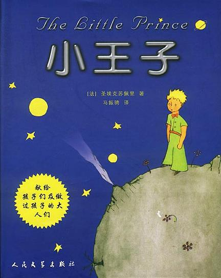

# 小王子

## 摘录

:::
沉默了一会儿，小王子和我说：“我有一天看了四十三次日落。那真的美极了！”

随后，他又说：“你知道，**当人寂寞的时候，感到忧伤的时候，他就喜欢看日落。**”
:::

---

:::
小王子爬山的时候，自言自语地说：

“当我站在这么高的山上时，我可以一眼望见整个星球，以及星球上所有的人。”

可是，当小王子爬到山顶时，他所看到的只有一些非常陡峭的悬崖峭壁。

“你好。”小王子试探地打招呼。

“你好……你好……你好……”回音在山谷间响起。

“你们是什么人？”小王子问。

“你们是什么人……你们是什么人……你们是什么人……”回音又响起。

“请你们做我的朋友吧，我很孤独。”他说。

“我很孤独……我很孤独……我很孤独……”回音又回答着。

小王子想道：“这颗行星可真奇怪啊！

它上面到处都是沙漠，显得干巴巴的。而且山上只有尖锐的石头，**人们连一点想象力也没有，他们只会重复别人的话，还说不完全。**”

小王子低下头，又想起自己的星球，在我的星球上，我至少还有一朵花。虽然它总是自己先说话……
:::

---

:::
“不是，”小王子说，“我来地球找人是想找一个人做朋友。那什么叫‘驯服’呢？”

“这是已经被人遗忘了的事情，”狐狸说，“它的意思就是‘建立联系’。”

“建立联系？”

“没错，”狐狸说，“**对我来说，你只不过是一个小男孩，就像其他千万个小男孩一样。我不需要你。你也同样不需要我。对你来说，我也不过是一只狐狸，和其他千万只狐狸一样。但是，如果你驯服了我，我们就有了联系，互相不可缺少了。对我来说，你就是世界上唯一的主人了；我对你来说，也就是世界上唯一的狐狸了。**”
:::

:::
“如果你驯服了我，我会辨认出一种与众不同的脚步声，就是你的脚步声。其他的脚步声只会使我躲到地下去，而你的脚步声却会像音乐一样将我从洞里叫出来。”
:::

:::
**“只有被驯服了的事物，你才会完全地了解他。”狐狸说，“人不会花费时间去了解自己没有驯服的事情。他们不会自己去种植东西，总是到商人那里去购买现成的东西。因为世界上还没有购买朋友的商店，所以人也就没有朋友。如果你想要一个朋友，那就驯服我吧！”**

“那么我应该做些什么呢？”小王子说。

**“首先，你必须非常有耐心。”狐狸回答道，“开始的时候你就这样坐在草丛中，坐得离我稍微远些。我用眼角瞅着你，你什么也不用说。话语是会让人误会的根源。但是，每天，你都要坐得靠我更近一些……”**

第二天，小王子按照狐狸说的话又来了。

**“你最好还是在原来的那个时间来。”**

狐狸说道，“比如说，你下午四点钟来，那么从三点钟起，我就会开始感到幸福。**因为等待自己爱的人是一件幸福的事情。时间越临近，我就越感到幸福。到了四点钟的时候，我就会坐立不安，我会想你怎么还没来；我就会发现原来被你驯服了就会付出幸福的代价。但是，如果你随便什么时候来，我就不知道该在什么时候准备好我的心情。**”

“你驯服我这件事情应当有一定的仪式。”

“仪式是什么？”小王子问道。

“这也是一件早已被人忘却了的事。”

狐狸说，“**它就是使某一天与其他日子不同，使某一时刻与其他时刻不同的约定。**比如说，捕捉我的那些猎人就有一种仪式。他们每星期四都和村子里的姑娘们跳舞。于是，星期四就是一个美好的日子！我可以一直散步到葡萄园去，也没有人捉我。如果猎人们每天都跳舞，天天过的一样，那么假期对于我来说就没有意义了。”

就这样，慢慢地，小王子驯服了狐狸。

**当出发的时刻快要来到的时候，狐狸说，“我想我一定会哭的。”**

“这都是你的错，”小王子说，**“我本来并不想带给你任何痛苦，可你却要我驯服你……”**

“事情就是这样的。”狐狸说。

“可你就要哭了！”小王子说。

“当然喽。”狐狸说，**“你驯服了我，我爱上了你，你要离开我了，我肯定会哭的。”**

“那么你什么好处也没得到啊。”

**“我得到了，你看麦子的颜色，我每次看到它，都会想到你，我知道了爱情的滋味，我也得到了好处。”**狐狸说，**“你再去看看那些玫瑰花吧。这一次你就会明白，你的那朵花确实是世界上独一无二的玫瑰。你回来和我告别时，我再赠送给你一个秘密。”**
:::

:::
“喏，这就是我的秘密。很简单：**只有用心才能看得清。实质性的东西，用眼睛是看不见的。你只有用心，才能看到事物的本质。**”
:::

:::
“正是你为你的玫瑰花费了时间，这才使你的玫瑰你变得如此重要。”
:::

:::
我对小王子说道：**“是的，无论是房子，星星，或是沙漠，使它们美丽的东西是看不见的！实质性的东西是眼睛看不见的。”**
:::

:::
但是，我放心不下他自己在这里。这时候，我想起了狐狸的话，**如果你一旦被人驯服了，就一定会承受到幸福的伤害，你可能会要哭的。**
:::

## 内容简介

小王子是一个超凡脱俗的仙童，他住在一颗只比他大一丁点儿的小行星上。陪伴他的是一朵他非常喜爱的小玫瑰花。但玫瑰花的虚荣心伤害了小王子对她的感情。小王子告别小行星，开始了遨游太空的旅行。他先后访问了六个行星，各种见闻使他陷入忧伤，他感到大人们荒唐可笑、太不正常。只有在其中一个点灯人的星球上，小王子才找到一个可以作为朋友的人。但点灯人的天地又十分狭小，除了点灯人他自己，不能容下第二个人。在地理学家的指点下，孤单的小王子来到人类居住的地球。

小王子发现人类缺乏想象力，只知像鹦鹉那样重复别人讲过的话。小王子这时越来越思念自己星球上的那枝小玫瑰。后来，小王子遇到一只小狐狸，小王子用耐心征服了小狐狸，与它结成了亲密的朋友。小狐狸把自己心中的秘密——肉眼看不见事务的本质，只有用心灵才能洞察一切——作为礼物，送给小王子。用这个秘密，小王子在撒哈拉大沙漠与遇险的飞行员一起找到了生命的泉水。最后，小王子在蛇的帮助下离开地球，重新回到他的B612号小行星上。

童话描写小王子没有被成人那骗人的世界所征服，而最终找到自己的理想。这理想就是连结宇宙万物的爱，而这种爱又是世间所缺少的。因此，小王子常常流露出一种伤感的情绪。作者圣埃克絮佩里在献辞中说：这本书是献给长成了大人的从前那个孩子。

《小王子》不仅赢得了儿童读者，也为成年人所喜爱，作品凝练的语言渗透了作者对人类及人类文明深邃的思索。它所表现出的讽刺与幻想，真情与哲理，使之成为法国乃至世界上最为著名的一部童话小说。

## 作者简介

安托万·德·圣埃克苏佩里（Antoine de Saint-Exupery, 1900-1944）1900年6月29日出生在法国里昂。他曾经有志于报考海军学院，未能如愿，却有幸成了空军的一员。1923年退役后，先后从事过各种不同的职业。

1926年，圣埃克苏佩里进入拉泰科埃尔航空公司。在此期间，出版小说《南方邮件》（1929）、《夜航》（1931），从此他在文学上声誉鹊起。1939年，又一部作品《人的大地》问世。

第二次世界大战期间他重入法国空军。后辗转去纽约开始流亡生活。在这期间，写出《空军飞行员》、《给一个人质的信》、《小王子》（1943）等作品。1944年返回同盟国地中海空军部队。在当年7月31日的一次飞行任务中，他驾驶飞机飞上湛蓝的天空，就此再也没有回来。
