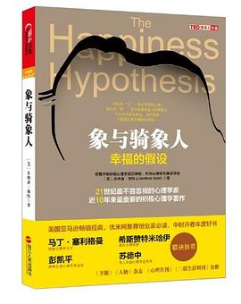

# 象与骑象人

## 摘录

### 前言 10 个幸福假设

:::
两个古老真理。

**第一个真理**是本书的最基本观念：**人类的心理分成若干部分，有时彼此还会互相冲突。**莎士比亚所说的：“**都是人的思想在作祟。**”或如佛陀所言：“**诸法意先导，意主意造作。**”

**第二个真理**是：**人天生就是“道德虚伪”**，这就是为什么人们很难忠实地遵照为人准则行事的原因。
:::

:::
人的存在有一种精神层面的垂直维度。你称之为“**高贵、美德或神性**”也好，你信不信上帝也无妨，但是人真的会在别人身上或在大自然中感受到神圣、庄严或那种难以形容的善。
:::

### 第一部分 人的心理是如何运作的【人象对峙】

#### 第1章 分裂的自我，是你产生心理冲突

##### 有关心理的古老比喻

:::
人类需要用比喻来思考。**我们对新事物或复杂事物的理解，是借助于已知的事物与前者间的关联。**
:::

:::
弗洛伊德指出，人格分成三个部分：**自我**（ego，即有意识、理性的自我）、**超我**（superego，即道德良心，有时会过于拘泥于社会规范）以及**本我**（id，即享乐的欲望，各种欲望，总想及时行乐）。

弗洛伊德认为，**精神分析的目的就是通过强化自我，让自我能更好地控制本我，并摆脱超我的束缚。**
:::

:::
我可以体会为何柏拉图会把不乖的马形容成“聋得像根柱子似的”。面对生活中一些重大的决定，**我真的开始对有些事感到无力。我明明知道自己该做什么，甚至也告诉朋友我会这么做，但我自己却隐约知道我不会这么做。罪恶感、贪欲或恐惧通常会战胜理智**。
:::

:::
罗马诗人奥维德（Ovid）有一段非常传神的描述。在《变形记》（Metamorphoses）里，女主角美狄亚夹在自己对杰森的爱与对父亲的责任之间，左右为难，痛苦万分。她哀叹道：
**一股奇妙的力量牵引着我向前。情欲及理性各自朝不同的方向拉扯着我。我很清楚哪一条是正确的路，心里也很认同，但我却踏上错误的路。**
:::

:::
现代的理性选择理论及信息加工理论并不足以解释人类意志的软弱。古代人驾驭动物的比喻则十分有用。当我在思考自己为何老是那么软弱时，我联想到的**自我形象就是我是一个骑在大象背上的人。我手里握着缰绳，只要动动缰绳，我就可以指挥大象转弯、停止或往前走。不过，只有在大象没有它自己的欲望时，我才指挥得了大象。一旦大象真的想做什么，我就根本斗不过它。**
:::

##### 4种自我分裂

:::
对人的“心理”的划分有四种方式，分别是**心灵和身体、左脑和右脑、理性和感性、控制化和自动化。**第四种最重要，因为它最符合骑象人及大象的比喻，不过前面三种划分方式也能解释我们在面对诱惑、软弱及内在冲突时的一些体验。
:::

:::
人的心理是由独立运作的部分联合组成的，有时候，它们意见相左、各行其是。
:::

:::
人类的理性其实非常依赖复杂的情感，因为只有当充满情绪的大脑运作顺畅时，理性才得以运转。
:::

##### 阻碍幸福的3个障碍

###### 幸福障碍1：无能的意志力

:::
单靠意志力，控制化系统是很难打败自动化系统的。控制化系统跟一紧绷便疲惫不堪的肌肉一样，很快就疲软无力，举白旗投降。不过，自动化系统则是无须费力且全年无休地自动运转。一旦你了解刺激性控制的力量，就可以改变环境中的刺激，避开恼人的刺激来源。如果没办法这么做，那你就多想想它们不吸引人的那一面。比如，佛陀为了打破人对肉体的沉溺，便想出静观腐尸的方法。只要眼睛瞪着看会让自动化系统反感的东西，骑象人就能改变大象以后的欲念。
:::

###### 幸福障碍2：心理干扰

:::
韦格纳的研究则提出一个更简单、更单纯的解释：自动化处理过程每天会产生好几千个想法及影像，这通常是通过随机联想形成的。那些一直缠绕在我们脑中的念头或影像，通常都是特别令人震惊、一直想压抑或否认的念头。我们之所以会压抑这些念头，并不是因为内心深处知道它们是真的（有些可能是真的），而是因为它们很恐怖或令人感到羞耻。一旦我们想压抑却又压抑不成，这些念头就会一直在脑中挥之不去，这就是为什么我们会相信弗洛伊德所说的：人的内心有黑暗且邪恶的一面。
:::

###### 幸福障碍3：冠冕堂皇的理由

:::
道德判断就跟审美判断一样。当我们看到一幅画时，通常马上就知道自己喜不喜欢。如果有人要我们解释为什么喜欢，我们就会乱编出一番说辞。其实我们并不完全了解自己为什么会觉得这幅画很漂亮，但我们的诠释模块（骑象人）就跟加扎尼加在裂脑研究中所发现的一样，很会编理由。你想为自己喜欢这幅画找出一个冠冕堂皇的理由，所以你就会抓住第一个说得过去的原因（可能是颜色或光线）。道德判断也一样。两人对某事意见相左时，其实是感觉在先，后来再来编理由反驳对方。就算你驳倒对方，难道对方就会改变心意，接受你的论调吗？当然不会，因为你驳倒的，并非对方真正的立场，他的立场是在他有了判断之后才临时编出来的。
:::

#### 第2章 是什么令你幸福

:::
发生在这个世界上的事情，只有通过我们自己对事件的诠释才能影响到我们，所以只要我们能控制自己对事件的诠释，就能控制自己的世界。
:::

:::
你认为生命本身是什么，它就是什么。
:::

##### 令你感到不幸福的3个原因

###### 不幸福的原因1：情感启动效应

:::
在大象所用的语言中，最重要的字眼就是“喜欢”或“不喜欢”，“接近”或“离开”。即便是头脑最简单的动物也必须随时做决定，是往左还是往右？往前走还是停下来？吃还是不吃？头脑复杂一点儿的动物会有足够的能力自动且毫不费力地做决定，因为它们脑中有一个随时在运转的“喜欢计量表”。如果一只猴子试吃一种以前没吃过的水果，感觉很甜，这时它的“喜欢计量表”就会显现“我喜欢”，这只猴子就会觉得很愉悦，马上大咬一口。如果水果吃起来是苦的，那么猴子就会表现不悦感，也不会再咬这个水果了。这根本不需要评估正反两种意见，或动用到分析推理系统，其依据就是心中出现的愉悦感或不悦感。

人类也有一个“喜欢计量表”，这个“喜欢计量表”无时无刻都在运转，对我们产生的影响相当微妙。实验显示，我们对于自己经历的一切事物，都会有“喜欢不喜欢”的反应，即便在下意识的情况下也是一样。
:::

:::
人生的三大决定——做什么工作，住什么地方，跟谁结婚，居然都受名字的发声这种如此细微之事的影响。人生确实是我们认为它是什么，它就是什么，但我们对人生的想法其实是在无意识中快速形成的。大象依本能反应，引导骑象人抵达新的目的地。
:::

###### 不幸福的原因2：负面偏好

:::
大多数人身上的大象看坏的事看得太多，看好的事看得又实在太少。
:::

:::
莎士比亚笔下的哈姆雷特也用自己的话道出与奥勒留相同的喟叹：“**事情没有好坏，一切都是人的想法在作祟。**”哈姆雷特说的没错，但他还可以加上一句：**是他的消极情绪让他自认为这世界上没有一件好事。**
:::

:::
这项我们称为“负面偏好”（negativity bias）的原则，充分显现于人类所有心理层面。**在夫妻关系的互动中，一句批评的话或一个破坏性行为造成的伤害，起码要有5个善意或建设性的行为才能弥补过来。**
:::

###### 不幸福的原因3：强大的遗传基因

:::
一讲到个性，大家都知道先天遗传及后天环境是影响个性的两大因素，但大部分人并不清楚先天遗传的影响有多大。
:::

##### 改变思维方式的3种方法

###### 方法1：冥想

:::
有意识地去控制自己的想法，专注凝神，头脑放空。
:::

###### 方法2：认知疗法

:::
智慧之道，在安静无为，无欲等待。
:::

:::
认知疗法最重要的，就是训练病人掌握自己的想法，把自己的想法写下来，指出扭曲之处，之后找出替代方案及更正确的思考方式。
:::

###### 方法3：百忧解

### 第二部分 我们如何相处【大象的力量】

#### 第3章 互惠

##### 互惠的应用

###### 以牙还牙

:::
以牙还牙，就是一报还一报，就是别人怎么对待我们，我们就怎么对待对方。
:::

###### 用语言造势

:::
邓巴认为，语言的进化就是用来取代梳毛功能的。有了语言，群体规模较小的成员便能很快地建立彼此的关系，了解其他成员间的关系。邓巴指出，人类使用语言，谈的其实都是别人的事——想知道谁对谁做了什么事，谁跟谁在一起，谁跟谁吵架等。邓巴还指出，在人类这种超群居社会中，社交关系处理得好的人容易成功。重点不在于你知道什么，而在于你认识谁。简言之，邓巴认为，人类之所以会进化出语言，是因为人要靠语言来说长道短。不管沟通方式有多原始，消息灵通的人总是比消息不灵通的人有优势。人一旦开始说人长短（流言），就会出现一场难以控制的比赛——所有人无不使出浑身解数来操控别人，破坏别人的关系，或保护自己的名声，凡此，皆要有超强脑力才能办得到。
:::

###### 模仿，人际关系的黏合剂

:::
业务员有六大推销技巧，其中最基本的就是互惠之道。那些想从我们身上得到东西的人会先给我们一点儿甜头尝尝，这就是为什么我们会从慈善组织拿到一大堆免费贴纸跟明信片的原因，其实都出自其营销顾问的巧思运用。
:::

###### 讨价还价

:::
你一让步，对方就跟会着让步。**在金融交涉中，那些先提出极端苛刻的条件然后再往后退让一步的人，会比那些一开始就提出合理条件之后便不再让步的人，更容易完成交易。**

**先提出极端苛刻条件，之后再让步，不仅会让你得到比较好的条件，还会让你得到一个愉快的合作伙伴**：因为你让对方觉得他们自己有决定最后结果的影响力，所以对方比较会同意接受这项条件。人与人之间的施与受，会让彼此产生一种伙伴关系，就算对接受的一方，也会有类似的效果。
:::

##### 如何提升互惠技巧

:::
朋友间的相处、情侣间的关系，也需要我们发挥互惠之道的精神。所有关系在一开始时，都处于非常微妙的阶段，**付出过多（似乎给人一种不顾一切之感）或付出太少（你好像有点儿冷漠且拒人于千里之外），都会毁掉彼此的关系。**健康的关系来自平衡的施与受，尤其是适当地互送礼物、互相帮忙、互相关心、互吐心声，都是培养彼此关系的重要技巧。
:::

:::
“互惠之道”可以说是处理所有人际关系的一剂大补帖。只要使用得当，便会对我们的人际关系产生强化、延长及活化的效果。互惠之道之所以能产生这么好的效果，部分原因是因为我们心中的大象天生就是一个模仿高手。比如，当我们跟自己喜欢的人相处时，会不自觉地想模仿对方的一言一行。对方拿脚打拍子，你就可能拿脚打拍子，对方摸自己的脸，你就可能也摸自己的脸。我们不只会模仿喜欢的对象，也会喜欢模仿我们的那些人。我们会比较乐于帮助喜欢模仿我们的人，对后者的态度也比较和善。懂得模仿顾客的女服务生，小费总是拿得比较多。
:::

#### 第4章 自以为是

:::
我们之所以喜欢把丑闻当娱乐，是因为**丑闻会让我们心生轻视别人之感，这种道德情绪也会让我们产生道德优越感。**
:::

##### 是什么让我们虚伪

:::
我们每个人都很虚伪，当我们蔑视别人虚伪之时，更显得自己加倍虚伪。
:::

###### 重视道德表象胜过道德真相

:::
权谋大师马基雅维利（Nicclo Machiavelli）在500年前写道：“**大部分人都非常满足于外表建构的假象，乐于把假象当成真实，事物的表象比事物的真相更具影响力。**”
:::

:::
罗伯特·赖特（Robert Wright）在其杰作《道德的动物》（The Moral Animal）一书中所言：“**人类这种动物一讲到道德就头头是道，但可悲的是人自己总是误用道德，最惨的是，误用道德后还浑然不知。**”
:::

###### 先做判断，再编造说辞

:::
哈佛大学的心理学家大卫·帕金斯（David Perkins）曾苦心致力于研究如何改善人们的思考推理，也发现了相同的结果。他指出，**一般人都采用“先选定自己的立场，再来找支持自己立场的证据”的思考方式。如此便足以证明自己的立场是“有道理的”，之后所有思考便戛然而止。在压力小的情况下，如果有人从相反的立场提出不同理由及证据，那么我们还比较愿意改变心意,但是我们不会自发地去做这样的反向思考。**
:::

:::
富兰克林得出这样的结论：“**要当个讲理的人其实很容易，不管你想做什么事情，你都可以帮自己找到或编出一个理由。**”
:::

###### 无意识的自我膨胀

:::
要想在人生竞赛中打胜仗，就必须把自己最好的一面表现出来，以昭世人，我们必须表现得很有美德（不管自己是不是真的很有美德），而且不管自己有没有资格，都必须得到合作的好处。
:::

:::
（之所以会出现抑郁，就是因为自己编的这套说辞走了样，变成了贝克的三种错误认知［参见第2章］：我很烂，这个世界很可怕，我的未来一片黑暗。）
:::

:::
在判断别人时，我们会依据对方的行为来做判断，但是对自己，我们却认为自己“里外如一”，所以我们很容易便可为自己的自私行径找到开脱的理由，然后一味沉溺在“自己高人一等”的幻想中。
:::

:::
模糊不清会助长我们的幻觉。因为很多特质（例如领导能力）有多种不同的定义，所以我们就会随意挑一个最符合自己特质的标准来谄媚自己。如果我是个有自信的人，我就会把领导能力定义为自信心。如果我对人很有一套，我就会把领导能力定义为了解、影响别人的能力。当我们拿自己跟别人相比时，我们的思考过程如下：先把议题定出来（无意识地、自发地），如此我们所认定议题中的特质，就会跟自己自认的优点联结起来，之后我们再来找证明自己拥有该优点的证据。一旦我们找到一项证据，就会觉得“果然如此”，之后一切就戛然而止，这时我们不再思考，开始自我陶醉。
:::

:::
有证据表明，**对自我、自己的能力、自己未来的远景秉持积极幻想的人，会比缺乏这种幻想的人更幸福，其心理更健康、更受人喜爱。**不过，这种幻想会让你觉得自己理应比别人获得更多，从而在自己与他人之间引发无尽的纷争，因为别人也认为他该得到同样的好处。
:::

###### “天真实在论”

:::
如果连配偶、同事以及室友之间都会发展到互相愤恨，那么彼此间没有感情基础或共同目标的人要谈判协商，就难上加难了，这就是为什么我们得耗费庞大的社会资源来处理诉讼案件、罢工、离婚纠纷及和平谈判破裂后的暴力冲突的原因，因为**人类的这种自私的偏见会激起人们心中的伪善愤慨。**
:::

:::
如埃普利及邓宁的研究，**人们对于有助于自己预测他人行为的信息确实持较开放的态度，但却不愿调整自己的自我评价。**在另一项研究中，洛温斯坦采用婚姻治疗师的咨询方法，要每位被试从对方的立场写一份非常具有说服力的文章，结果情况更糟。这种方法之所以会起到反效果，可能是因为**站在对方立场思考反而会刺激自己更加努力去思考如何辩驳对方立场。**
:::

:::
大家都很乐于了解各种自私的偏见，也知道应用这些知识来预测别人的反应，但是自己的自我评价还是不动如山，就算你拉着对方的衣领，摇着他的身体告诉他：“仔细听着！大部分人的自我评价都是自我膨胀，你应该务实一点儿！”他们也根本不信你这套说法，还是会自言自语道：“别人可能有偏见，但是我真的是个优秀的领导人才。”
:::

:::
普罗尼及罗斯在深入研究这种抗拒面对真实自我的态度后，称这种现象为“天真实在论”（naive realism），即**我们每个人看到的、感觉到的世界是最真实的世界，我们相信自己看到的事实，每个人也都看得到，所以别人应该跟我有一样的想法。如果别人有不同的想法，要么就是他们没有看到真正的事实，要么就是他们被自己的利益及意识形态蒙蔽。**
:::

##### 为何会有邪恶与残暴

###### 善恶之战

:::
“我们的人生是心理创造出的产物”，我们的心理慢慢学会使用马基雅维利式的“以牙还牙”策略。我们每个人都会做出自私、短视的行为，但我们内心的辩护律师则会确保自己不会把过错怪到自己身上。如此，我们就会确信自己做的都是对的，但却能很快看出别人充满偏见、贪婪及口是心非的那一面。我们总能正确地判断出别人的动机，但一旦自己遇到冲突，就会开始夸大自己的善行，编出一个善（自己这一边）恶（别人那一边）大战的故事。
:::

###### “邪恶至极”的迷思

:::
鲍迈斯特之所以是个非常优秀的社会心理学家，部分原因是他坚持追求事件真相。确实有无辜的人会莫名其妙地碰到邪恶的坏事，但大部分的案件其实都很复杂，鲍迈斯特则**愿意打破“不要怪罪被害人”**的禁忌，坚持找出事实真相。
:::

###### 邪恶与残暴的4个成因

:::
前两个是邪恶的属性：**贪婪、野心**（例如抢劫案，个人为了能直接获利而使用暴力）及**虐待狂**（从伤害别人中得到乐趣）

不过，贪婪、野心只解释了小部分暴力事件的成因，虐待狂则几乎不成原因。
:::

:::
邪恶两个最大的成因是：**自尊心太强及道德理想主义。**

自尊心强并不会直接导致暴力，但是如果你的自尊心过强，造成自己脱离现实或过度自恋，你就会很容易觉得受现实所迫。而当面对这些威胁时，特别是年轻人，往往会激烈抨击社会。

从个人角度来看，自尊心受威胁确实是暴力事件的主要成因，而理想主义则是造成大规模杀戮事件的主要原因——因为秉持这种想法的人认为，自己的暴行是追求道德目标的一种手段。
:::

##### 如何寻得完满之道

:::
人类学家克利福德·格尔茨（Clifford Geertz）曾写道：“**人类是一种悬浮在自己所编织的意义之网中的动物。**”也就是说，我们生存的世界并不是真的由岩石、树木等实物建造而成，而是**一个由辱骂、机会、身份象征、叛徒、圣人及罪人构筑的世界。**
:::

:::
伯恩斯也建议我们要有共情：**面对冲突，要从对方的观点来看事情，这样你才能理解对方并非无理取闹。**
:::

:::
我基本上同意伯恩斯的做法，但是一旦双方开始动怒，要彼此产生共情，去了解对方立场，可能就有点儿缘木求鱼。遇到这种情况，耶稣的话比较实际：“**先去掉自己眼中的梁木。**”（巴特森跟洛温斯坦都发现，被试一旦被迫审视自己，原有的偏见就会消失。）只有在非常刻意的努力之下，我们才会看到自己眼中的梁木。
:::

:::
**虚伪及乱下判断是重创人际关系的两大杀手，找出自己的过错，也是克服这两项恶习的关键所在。**当你发现自己也是造成双方冲突的元凶时，你心中的怒气就会降下来——或许你的怒气不会完全消失，但你起码可以恢复一点儿理智，承认对方也有对的地方。你可能还是认为自己是对的，对方不对，但现在的立场已修正为自己大部分是对的，对方大部分不对，这时双方就可以找到一个不伤彼此感情的台阶。你可以这么告诉对方：“**我不应该做X这件事，所以你会有Y这种感觉，我可以理解。**”在平等互惠的压力之下，对方可能会觉得自己也应该有所表示：“**你做了X这件事，我真的很不高兴，不过我也不应该做出P这件事，你会有Q的反应，我完全可以理解。**”互相报复的心理，一旦有自私的偏见在一旁火上浇油，双方就会陷入交相指责中，让情况变得更不可收拾，但是我们可以把互相报复的心理逆转成互相理解的心理，以终止冲突，保住彼此的关系。
:::

### 第三部分 追求幸福的方法【驭象之道】

#### 第5章 幸福来自何处

- 善人离诸（欲），不论诸欲事。苦乐所不动，智者无喜忧。——佛陀
- 不求事如己愿，但求凡事顺乎自然，如此人生就会顺遂自得。——古罗马哲学家，爱比克泰德

:::
如果金钱及权势可以买到幸福，那么《圣经·旧约·传道书》的作者应该能登上狂喜的巅峰。这本书的主要内容是耶路撒冷一位国王回顾自己的一生，回忆自己对幸福及满足的追逐过程。这位国王决定用自己的财富追求幸福，测试金钱能否买到幸福。

我曾做过的大事——为自己建造房屋，栽种葡萄园，修造花园，在园中栽种各类果树，又拥有大群牛羊，胜过任何比我先在耶路撒冷的人所拥有的。我又为自己积蓄金银，以及列王和各省的财宝。我又为自己招募男女歌手，纳了许多妃嫔，是世人所以为乐的。于是我日渐昌大，超过任何比我先在耶路撒冷的人；我的智慧仍然与我同在。我眼中所求的，我都不禁止。

不过，作者接下来却发现，这些身外之物其实让人空虚（接下来这段话可能是人类最早出现的关于“中年危机”的记载）。

然后，我省察我所做的一切，以及我劳碌换来的成就，想不到一切都是虚空，都是捕风，在日光之下毫无益处。

《圣经·旧约·传道书》的作者告诉我们他追求幸福的种种方法——艰苦奋斗、学习、品尝美酒，但是这些东西都无法让他满足，而且这些身外之物也无法赶走他心中的空虚感：跟动物相比，自己的人生并不存在任何更本质或具有更高目标的价值。从佛陀及斯多葛学派哲学家爱比克泰德的观点来看，《圣经·旧约·传道书》作者的问题再明显不过：**他太努力去追求幸福。**
:::

:::
佛教及斯多葛学派教诲我们：**追求身外之物，或强求世事如己所愿，最后只是一场空。幸福只能内求诸心，断除对身外之物的执著，对一切采取接受的态度。**
:::

##### 幸福的两个原则

###### 幸福原则1：进展原则

:::
《圣经·旧约·传道书》的作者面对的不只是人生没有意义的恐惧，他还得面对成功会让人失望的事实。**得到自己想要的东西固然让人幸福，但这种幸福通常很短暂。**
:::

:::
**追求目标时真正重要的是过程，不是结果。**因此，先为自己设定目标，每朝着目标前进一步，我们都会感觉到朝着目标前进的幸福与满足。成功来临的那一刹那，我们心里的感觉其实是像走完漫长的旅程卸下沉重背包时的那种如释重负之感，而不是欣喜若狂。人们总是朝着目标，全力以赴，以为自己达成目标时会欣喜异常。然而当成功降临时，我们其实只是感觉到一点点短暂的幸福感，这时我们不禁要问：难道就是这样？于是我们会忍不住去贬低自己的成就，认为自己的努力根本是一场空。
:::

:::
我们称此为“进展原则”，即**朝着目标前进比达成目标要幸福。**莎士比亚说得好：“**成功之时，一切已结束；努力的过程是最幸福的。**”
:::

###### 幸福原则2：适应原则

:::
不管发生什么事情，我们终究会慢慢适应，只是事情刚刚出现时，我们不知道自己有这样的能耐。我们很不善于准确地预测自己未来的情绪，往往会高估自己情绪反应的强度及持续性。
:::

:::
这就是“适应原则”：**人对现况的判断，是以比自己现已适应的更好或更坏为基准。**
:::

:::
当我们了解适应原则的原理，又发现人的平均快乐程度是跟遗传基因有很大的关系时，就得面对一个惊人的事实：**从长远来看，人生际遇如何其实并不重要，不管是好运还是坏运，我们最后都会回归自己的幸福起始点（happiness setpoint）**，即大脑系统默认的快乐程度，而这基本上是由我们的基因决定的。1759年，早在世人知道有基因这种东西之前，亚当·斯密（Adam Smith）便得出同样的结论：

**在恒常状况下，即不预期会出现变化的情况下，每个人的心理迟早都会恢复平常的自然平静状态。碰到顺境，一段时间后，我们的心理就会恢复平常的平静；遇到逆境，一段时间后，情况亦然。**
:::

:::
在真实的人生里，你可以拼命努力，累积大笔财富，拥有满园果树等，但是你最多也只能如此，因为你无法改变自己“平常的自然平静状态”，你积聚的财富只是让自己对金钱有更高的渴望，但你并不会比有钱之前还要幸福。**因为不了解追求身外之物只是徒然，所以我们才会不停地追逐，努力让自己成为人生游戏中的赢家。**我们一直想拥有比现在更多的东西，追呀，追呀，追个不停，就像一只在转轮上跑个不停的仓鼠。
:::

##### 古代的幸福假设

:::
佛陀、爱比克泰德以及其他许多古圣先贤都看出：追求身外之物只是徒然，所以强烈地要大家不要追逐身外之物。他们提出一套幸福的假设：**幸福来自我们的内在，强求这个世界顺应自己的欲望是找不到幸福的。**佛陀教诲我们执著是苦，并告诉我们断除执念的方法。古希腊斯多葛学派的哲学家则教育追随者们，**把所有注意力放在自己可以完全控制之物上，也就是自己的想法及反应。其他的事物，如命运的赏赐或诅咒，都是外物，真正的禁欲主义者是不为外物影响的。**
:::

###### 两个幸福发现

:::
研究人员研究幸福时有两大发现：第一，基因对个人的平均幸福程度影响很大；第二，大部分的环境因素及人口统计因素对幸福影响甚微。
:::

###### 人无法从外在事物中找到幸福

:::
佛陀及爱比克泰德要是听到前述研究结论，一定会鼓掌赞同，因为他们早就发现，人无法从外在事物中找到幸福。现代人跟古代人一样，**把自己的时间和精力拿来追求一些不会让自己更幸福的目标，却在盲目追逐的过程中忽略了个人内在成长及精神层面的修为，而这才是真正能带给我们满足感的东西。**古圣贤哲一再教诲我们，**要懂得放手，不要再汲汲营营，选择一条新的人生道路。转向自己的内在，最重要的是不要再强求外在世界符合己之所愿。**克利希纳指出，**人有劣根性，而且克制不了这些劣根性，人会用各种希望把自己捆上几百个手镣脚铐，内心充满怒气与欲望，用尽各种不公义的手段积聚财富，以满足自己的贪欲。**克利希纳用讽刺的语气道出这些贪婪人魔的嘴脸：

今天我得到这个，明天一时兴起我就要满足另一种欲望；这是我的财富，以后还会有更多财富。谁要成了我的敌人，我就杀了他，有多少敌人，我就杀多少人。我是这里的大王，我高兴怎样就怎样，我是个快乐、成功的强者。
:::

##### 幸福方程式

:::
基因对一个人的影响确实远超乎我们的想象，但是基因本身对环境因素的反应也相当敏感。
:::

:::
心理学家索尼亚·柳博米尔斯基（Sonja Lyubomirsky）[插图]、谢尔顿（Ken Sheldon）以及施卡德（David Schkade），检查手上所有的证据后发现，影响一个人幸福与否的外在因素基本上可分成两大类——**个人本身的生活条件，以及个人选择的自发性活动。**
:::

:::
所谓的个人生活条件，是指自己不能改变的事实（种族、性别、年龄及残障等）以及自己能改变的事实（财富、婚姻状况及居住地等）。这些生活条件起码会在人生中持续一段时间，所以我们大抵都能适应。自发性活动则是出自个人选择，如冥想、运动、学习新技能、放假等。因为这些自发性活动一定是出于个人选择，且需要花相当多的时间和精力才能完成，所以这些自发性活动自我们意识中消失的方式，跟个人本身生活条件消失的方式，就会有所不同。自发性的活动能带给个人更多幸福，不像适应原则，时间一久，人的反应就递减。

积极心理学提出的最重要概念，就是柳博米尔斯基、谢尔顿、施卡德以及塞利格曼所称的“幸福方程式”：

**H=S+C+V**

我们真正感受到的幸福持久度（H），取决于我们天生遗传的幸福的范围（S），加上我们的生活条件（C），再加上我们自己可以控制的因素（V）。
:::

## 简介

### 内容简介

人类的心理，有一半正如一头桀傲不驯的大象，而另一半则是像是一个理智的骑象人。这两个分裂的部份，造成人们常陷与理智与非理智的思想争战中。

作者学贯中西，融合心理学、哲学、伦理学、宗教、人类学多学科知识，大量引用古今东西方哲学、文学与宗教中有关心理的看法，继而以现今神经科学与社会心理学的研究成果，来验证这些古老的智慧，作为实证论述的基础，除了让人看到整个20世纪心理学与精神医学曾经是多么地扭曲，同时也积极正面地提出了人类如何可以寻找到快乐与生命的意义，帮助自己在人际关系、心理层面与道德层次成长。这种有关“积极心理学”的讨论书籍，是国内较少出现的心理学科普作品类型。

### 作者简介

乔纳森·海特，著名积极心理学家。他在宾夕法尼亚大学攻读社会心理学，获得哲学博士学位后，来到芝加哥大学研究文化心理学。1999年以来积极投身于“积极心理学运动”，成为积极心理学的先锋派领袖之一。

2001年，他以对积极心理学的杰出贡献以及对“提升感”的研究，获得“坦普尔顿奖（JohnTempleton）”，为他赢得了极高的声誉。

坦普尔顿奖是当今国际奖金最高的奖，以比诺贝尔奖更高的奖金额而闻名，奖励在“精神领域”的研究中有非凡杰出成就、有助于增进人类神圣创造力的人士，每年只有四位领域的顶尖人士才能获此殊荣,特雷莎修女是该奖的第一个获得者。
